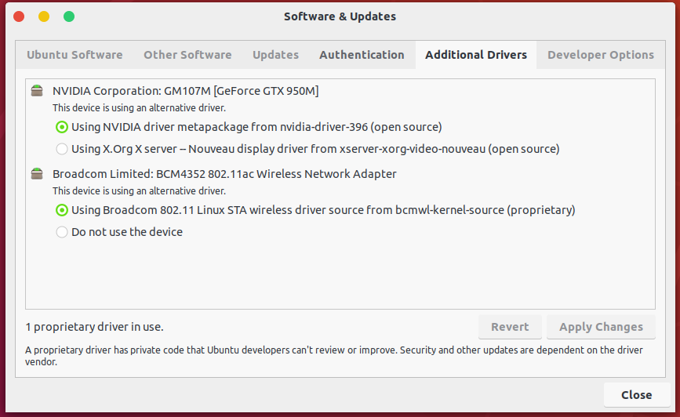
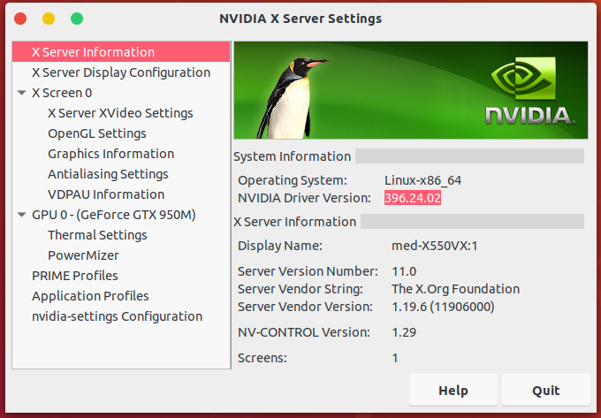

# Ubuntu 18.04 LTS - Anaconda | Python 2.7 | JupyterLab | TensorFlow-GPU | Keras | OpenCV | Nvidia | CUDA | CUDNN | Kurulumu

[](https://assets.ubuntu.com/v1/8dd99b80-ubuntu-logo14.png)

### Kurulum Aşamaları

  - Usb belleği hazırlamamızı sağlayacak Etcher programını indirmek.
  - Ubuntu 18.04 LTS dağıtımını indirmek. 
  - Usb Belleği kuruluma hazır hale getirmek.
  - BIOS ayarları.
  - Kurulumu tamamlamak.
  - Nvidia Driver kurulumu.
  - Anaconda kurulumu.
  - JuyterLab kurulumu.
  - TensorFlow-GPU kurulumu.
  - Keras kurulumu.
  - OpenCV kurulumu.
  - Diğer gereken kütüphanelerin kurulumu.

### Etcher İndirme

  -[Etcher](https://etcher.io/)  bu linkden işletim sisteminize göre programı indirin.


### Ubuntu 18.04 LTS İndirme

  -[Ubuntu 18.04 LTS](https://www.ubuntu.com/download/desktop)  bu linkden Ubuntu'nun iso dosyasını indirin.
  
  
### Usb Belleğin Hazırlanması

  - Usb Belleğiniz içindeki dosyaları yedekleyin
  - Etcher programında Ubuntu iso dosyasını seçin
  - Usb belleğinizi seçin
  - Yazdırma işemini başlatın.
   
[](https://etcher.io/static/screenshot.gif)
  
  
### BIOS Ayarları

  - BIOS ayarlarından "Secure Boot" seçeneğini kapatın.
  - Boot sekmesinde Usb belleği üst sıraya taşıyın.
  
### Kurulum

  - Usb belleğinizden boot ettikten sonra "Install Ubuntu" seçeneğini seçerek kuruluma başlayın
  - Mümkünse kablolu olarak bilgisayarı internete bağlayın değilse kablosuz bağlamanmak için Ubuntunun kurulum aşamasında Wifi kartınızı tanıması gerekmektedir.
  - Dil seçeneğini İngilizce olarak seçmenizi tavsiye ederiz
  - Sabit diski seçerek kurulumu tamamlayın.
  - Sistem yeniden başladıktan sonra şifreyi girdiğinizde sistem kitlenebilir veya siyah ekran ile karşılaşabilirsiniz sorun ekran kartı sürücüsünden kaynaklıdır.
  

### Nvidia Driver Kurulumu

   - ##### Masaüstü açıldı ise ;
     - Terminali açın ve `Sürücü Kurulumu` aşamasına geçin.
   - ##### Sistem kitlendi veya siyah ekranda kaldı ise ;
     - Şifre girildikten sonra sistem kitleniyorsa bilgisayarı yeniden başlatın
     - Şifreyi girmeden`Ctrl + Alt + F2` ile Terminali açın (İnternet bağlantısı gereklidir)
     - Kullanıcı adınızı ve şifrenizi girerek terminalde oturum açın (Büyük - Küçük harf önemli)
     - `Sürücü Kurulumu` aşamasına geçin.
    
   - ##### Sürücü Kurulumu
     - İlk olarak update ve uprade işlemini yapın 
        -   ```sh
            $ sudo apt-get update
            $ sudo apt-get upgrade
            ```
       
     - Nvidia ile ilgili herşeyi temizliyoruz
        -   ```sh
            $ sudo apt-get purge nvidia* 
            ``` 
     - Nvidia grafik sürücüsünün kurulması için gereken kaynağı ekleyin
        -   ```sh
            $ sudo add-apt-repository ppa:graphics-drivers
            ```
    
     - Yeni kaynak eklediğimiz için tekrar update işlemi yapıyoruz
        -   ```sh
            $ sudo apt-get update
             ```
    
     - Nvidia sürücüsünün 390 sürümünü kuruyoruz
        -   ```sh
            $ sudo apt-get install nvidia-390 
             ```
     - Kurulum işlemi tamamlandıktan sonra bilgisayarı yeniden başlatıyoruz.
        -   ```sh
            $ reboot 
             ``` 
     - Tüm aşamalar hatasız tamamlandıysa masaüstü açılması gerekir. `Sürücü kontrol` aşamasına geçin

  - ##### Sürücü Kontrolü
     - Ekran kartı bilgilerinde ekran kartınızın tam modeli listelendi ise kurulum başarılıdır.
        -   ```sh
            $ nvidia-smi
             ``` 
      - Ekran kartı için gerekli detaylı bilgiler için "Nvidia Settings" kullanabilirsiniz.
         -   ```sh
             $ nvidia-settings
                ``` 
                
  - ##### Sürücü Güncelleme
      - Ekran kartı sürücüsü olarak 390 sürümünü kurduk fakat CUDA 9 ve CUDNN 7.1.2 sürümleri Nvidia 396 sürümü ile uyumludur bu yüzden beta olan Nvidia 396 sürümünü elimizle değiştirmemiz gerekmektedir.
      - Uygulamalardan `Software & Updates` uygulamasını açın ve `Additional Drivers` sekmesinden Nvidia 396 sürümünü seçin, ayarları kaydedin.Sistemi yeniden başlatın
    
    
      - Ekran kartı sürücü kontrolü için "Nvidia Settings" i açalım. Sürüm resimdeki gibi 396 ise ekran kartının sürücü kurulumu tamamlanmıştır.
         -   ```sh
             $ nvidia-settings
                ``` 
     
      
    
